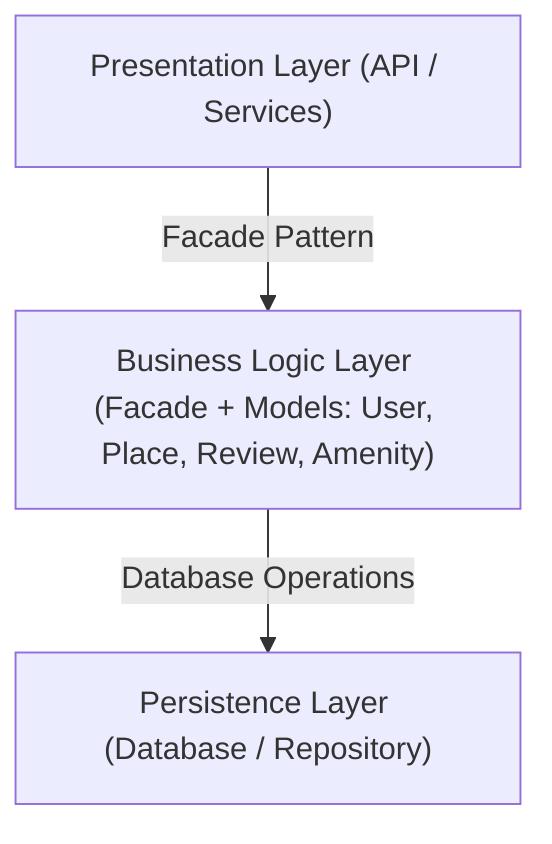
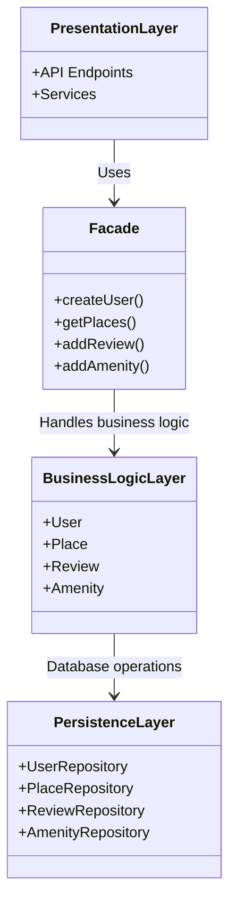
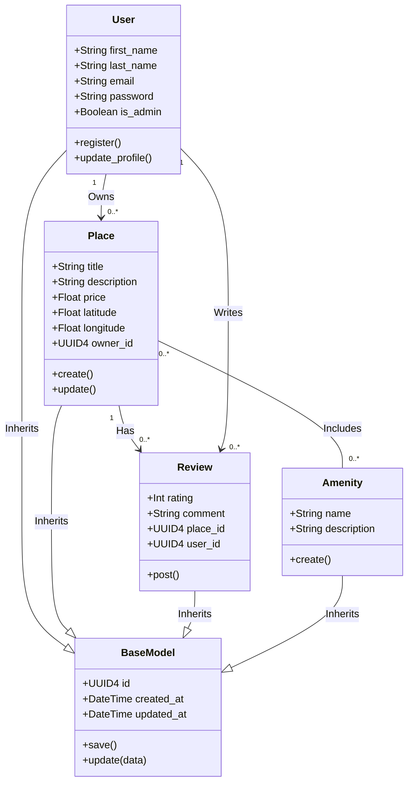
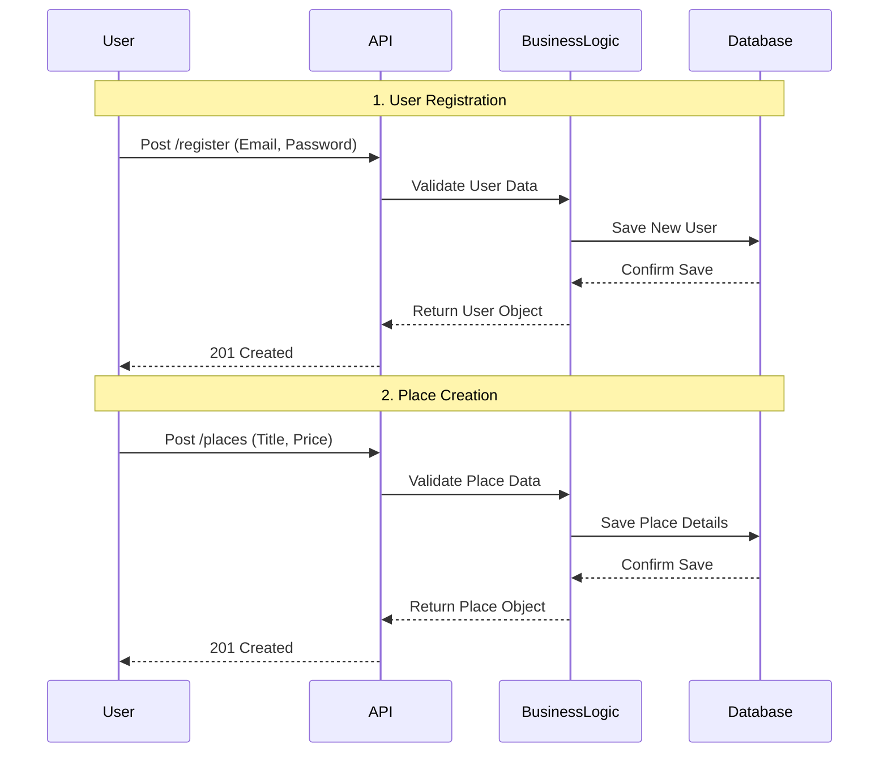

# ⚠️⚠️⚠️HBnB - Technical Documentation

## ‼️‼️‼️TASK 0. High-Level Package Diagram

  ### Overview
    This document describes the high-level architecture of the HBnB application.
    The system follows a three-layer architecture to ensure a clean organization and clear separation of responsibilities.
  
  ---
  
  ### Layer Descriptions
  
  #### 1. Presentation Layer
    This is the entry point of the application. It handles the communication between the user and the system.
      Function: It receives requests from users and sends back responses.
      Components: It includes API endpoints and Services.
    
  ### 2. Business Logic Layer
    This is the "brain" of the application where all decisions are made.
      Function: It manages the core logic and applies business rules. It validates data and controls how the application behaves.
      Components: It contains the main models: User, Place, Review, and Amenity.
      Integration: It uses the Facade Pattern to simplify communication between the layers.
    
   #### 3. Persistence Layer
    This layer is responsible for data storage and retrieval.
      Function: It talks directly to the database. Its job is to save information and fetch it when needed.
      Components: Repository classes (UserRepository, PlaceRepository, etc).
---
## Architecture Diagram

---

### The Facade Pattern
    The Facade pattern acts as a simplified interface between the Presentation Layer and the Business Logic Layer. 
    
    Why we use it: Instead of the API talking to many different classes, it only talks to the Facade. 
    Benefits:
        It hides internal complexity.
        It keeps the system clean and organized.
        It reduces tight coupling (dependencies) between layers.

---

### Communication Flow
    1. Request: The user sends a request to the Presentation Layer.
    2. Forward: The request is forwarded to the Facade.
    3. Process: The Business Logic Layer processes the request and checks rules.
    4. Storage: The Persistence Layer saves or retrieves data from the database.
    5. Response: The result is returned back to the user through the same path.

---

---
---
## ‼️‼️‼️TASK 1. Detailed Class Diagram for Business Logic Layer
  ## Overview
    This document describes the Business Logic Layer for the HBnB application.
    It shows the main objects (classes), their data (attributes), and how they work together (relationships).
    We use a layered architecture to keep the code clean and organized.
  
  ---
  
  ## Business Logic Layer
  
    This layer is the heart of the application. It manages the rules and data for the following objects:
    
    1.  BaseModel: The foundation. It provides a unique ID, created_at, and updated_at timestamp for every other class.
    2.  User: Manages user information like names, email, and password. It also identifies if a user is an Admin.
    3.  Place: Represents the rental units. It includes details like price, location, and the owner_id to link it to a user.
    4.  Review: Handles ratings and comments left by users for specific places.
    5.  Amenity: Lists extra features available at a place, such as Wi-Fi, swimming pool, or parking.

---

## Class Diagram

The following diagram represents the internal structure and inheritance of our system:

---
---
## ‼️‼️‼️Task 2. Sequence Diagrams for API Calls
  ## Overview
    This document shows how the HBnB application handles main user requests.
    It shows the communication between the User, API, Business Logic,
    and Database for the most important actions.
  
  ---
  
  ## API Call Flows
    Below are the steps for the two main actions:
    1. User Registration: How a person joins the app.
    2. Place Creation: How a user adds a new house or room.

