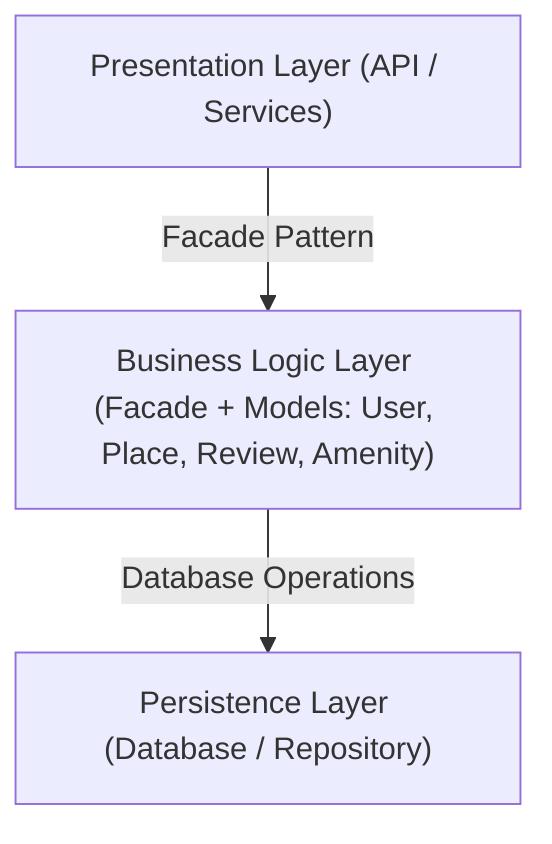

HBnB

--------------------------
High-Level Package Diagram

```mermaid

flowchart TD

A["Presentation Layer (API / Services)"]
B["Business Logic Layer (Facade + Models: User, Place, Review, Amenity)"]
C["Persistence Layer (Database / Repository)"]

A -->|Facade Pattern| B
B -->|Database Operations| C
```
eojds

